# Cross Stitch Art

(By Laura Kondrataite)

  

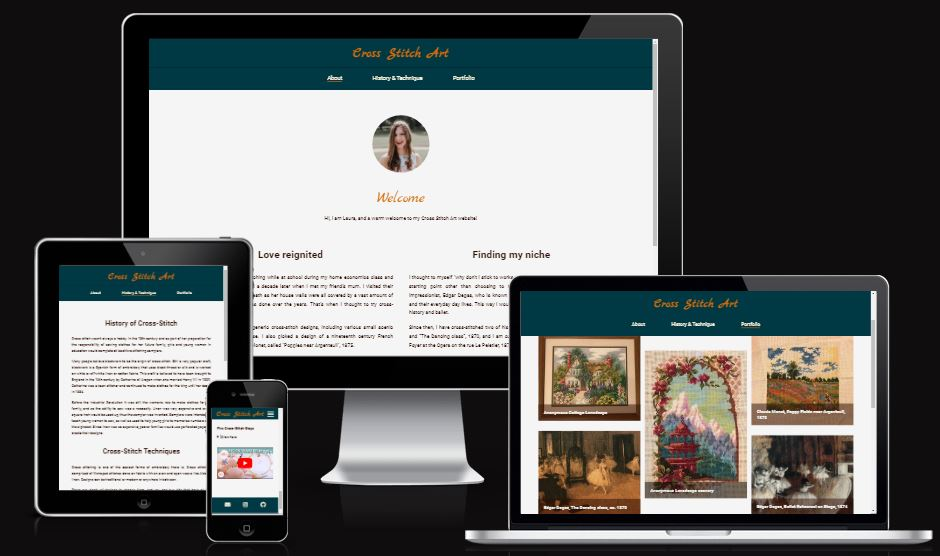

The Cross Stitch Art is a cross-stitch portfolio website showcasing the development and progression of cross-stitch embroidery of one individual. Users will be able to read about the crafter, familiarise with the history of cross-stitch embroidery, delve into the craft of cross-stich by watching a video and view a portfolio gallery showcasing the crafter's completed and current projects. The user will also find contact information in order to get in touch with the crafter.

The website was also created for the use of the crafter to promote their portfolio, and allow to connect with peers and audiences that are interested and curious about embroidery.

The website is responsive across a range of devices, is accessible and easy to navigate for all user audiences.  

The Cross Stitch Art was primarily created for educational purposes as part of Code Institute's Web Develpment Diploma course for HTML and CSS portfolio project. However, there is scope to continue developing and making the website an active portfolio platform in the future.

Link to live page: [Cross-Stitch-Art](https://laurakond.github.io/Cross-Stitch-Art/)


## Table of Contents

[Design](#design)
- [Target audience](#target-audience)
- [User Stories](#user-stories)
- [Wireframes](#wireframes)
- [Colour palette](#colour-palette)
- [Font styles](#font-styles)

[Features](#features)
 - [Existing features](#existing-features)
 - [Features Left to Implement](#features-left-to-implement)
 - [Accessibility](#accessibility)

[Tools and Technologies](#tools-and-technologies)
- [Languages used](#languages-used)
- [Frameworks, Libraries and Programs used](#frameworks-libraries-and-programs-used)

[Deployment](#deployment)

[Testing](#testing)
- [W3C Validator testing](#w3c-validator-testing)
- [Unfixed bugs](#unfixed-bugs)
- [Lighthouse](#lighthouse)

[Credits](#credits)
- [Used Code](#used-code)
- [Content](#content)
- [Media](#media)
- [General resources](#general-resources)
- [Acknowledgments](#acknowledgments)
- [Code Inspiration](#code-inspiration)


## Design

### Target audience
The primary target audience for the website is persons of any gender aged 16+ who enjoy crafts, are interested in or already doing crafts themselves. No specific background, geographical location or income has been noted as a requirement. 


### User Stories
Users:
- As a user, I want to find other like-minded crafters and familiarise myself with their story and see their completed works
- As a user, I want to find out about cross-stitching and how to start doing it myself
- As a user, I want to connect with other crafters
- As a user, I want to navigate the website easily
- As a user, I want to find a cross-stitching crafters that recreate works of art in embroidery
- As a user, I want to follow the progress of the crafter and their projects' development
- As a user, I want to be able to contact the crafter directly

Owner of the website:
- As the owner of the site, I want to display the website so that users can read about me and my cross-stitching journey
- As the owner of the site, I want to share my hobby with other like-minded people
- As the owner of the site, I want to connect with other crafters
- As the owner of the site, I want to share my passion for art using a different medium
- As the owner of the site, I want the users to be able to connect with me

### Wireframes
The following wireframe mockups show initial idea of how the website would look on three different devices: mobile, tablets and laptops/desktops.

#### Mobile 

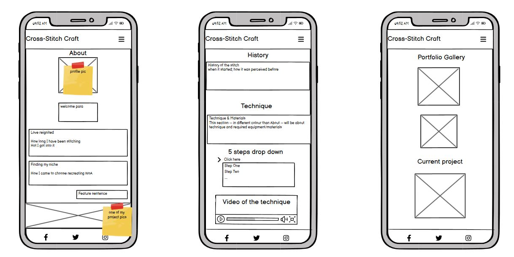

#### Tablet

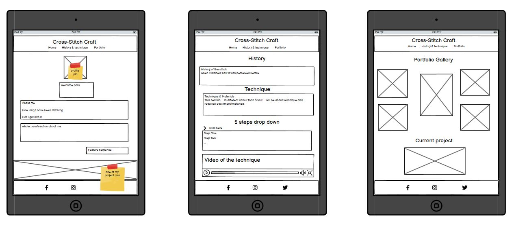
  
  #### Laptop/Desktop

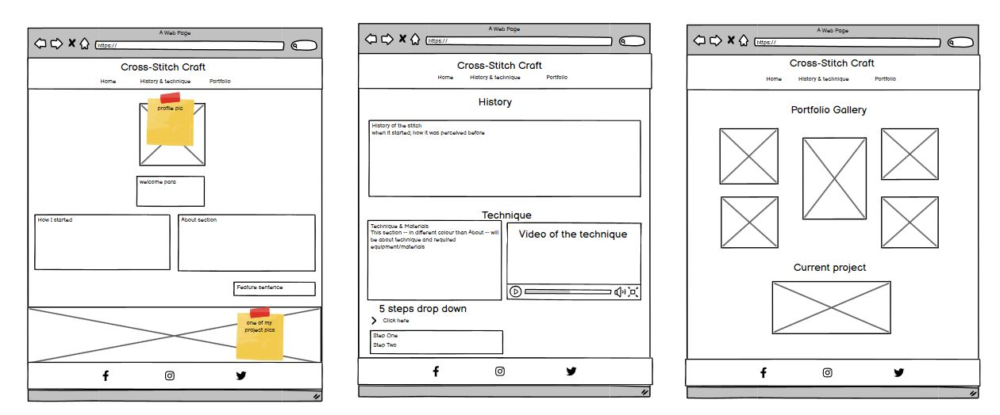

### Colour palette

The following color scheme was used to ensure contrast is achieved between main parts of the website:
- #F5F5F5 - White smoke - for main background
- #003844 - Midnight green - for header and footer background
- #F4ECD6 - Parchment - for font and icons in the header and footer sections
- #D36D0D - Cocoa brown - for the website logo and to put accent on particular parts of the content
- #2E0E02 - Black bean - for main font color

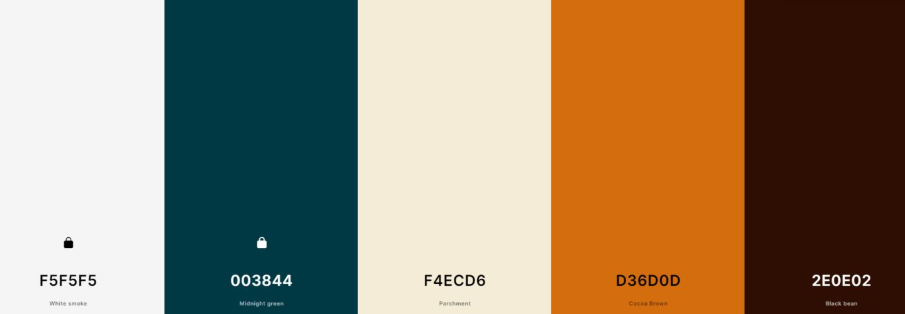

### Font styles

I used [Google fonts](https://fonts.google.com/) to source fonts for the website. These are:

- Roboto, sans-serif - was used as the main content font.
- Marck Script, cursive - was used for the logo and provide accent pieces to the website. 
 
 [Return to Table of Contents](#table-of-contents)


## Features

The website is comprised of four pages: a Home page, a History & Technique page, a Portfolio page and an Error 404 page. The latter is hidden from the user, and is only visible when a wrong website address is entered. 

All features are fully responsive on mobile, tablets/iPads, laptops and desktops. 

### Existing features

**The Header**

- Featured in all pages, the header is fully responsive and includes links to the Logo, Home page, History & Technique page and Portfolio page and is identical in each page. 
- The header is fixed at the top of the page as the user scrolls down. This allows easy navigation from page to page across all devices without having to use the ‘back’ button to previous pages.
- A feature border line appears under the active page's name indicating to the user the page they are on. 
- On a mobile device, the header is changed to a logo and a burger toggle bar to ensure good user experience practice. Upon clicking on the burger bar, the rest of the navigation bar opens up underneath the logo. 

    

    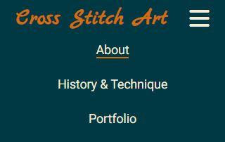

**The Footer**

- Featured in all the pages, the footer section contains links to relevant social media sites for Cross Stitch Art, including an Instagram page and a Github page. It also contains an email icon that opens an email screen upon clicking. All links open in a new tab to allow easy navigation for the user.

<br>

**The Home page**

- **The profile photograph and a stylised wecome note** has been used to familiarise and engage the user to read on. 

  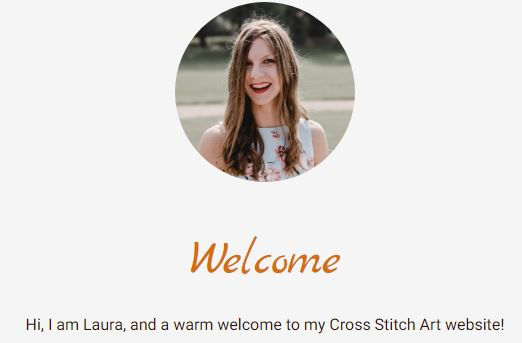

- **About the crafter section**. This section is split into two short paragraphs each delving deeper into the crafter's journey to discovering cross-stitching and identifying her niche. The content is kept short and simple so that the user feels engaged with the content.

  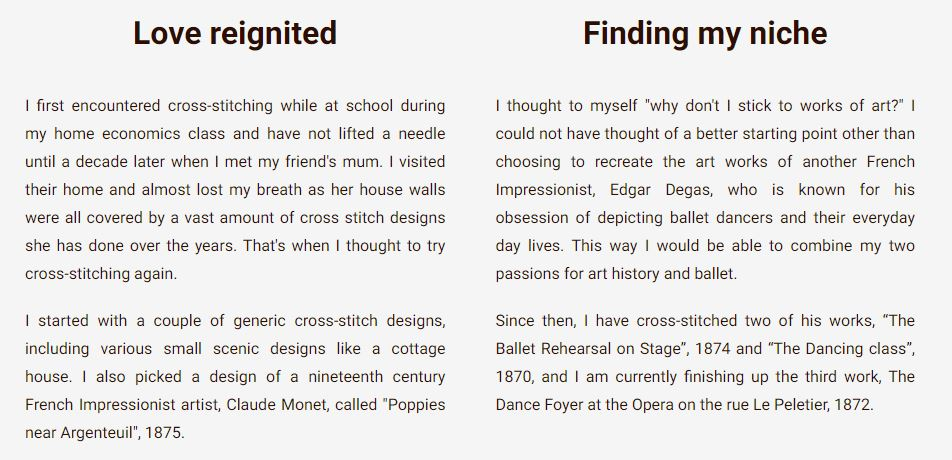

- **Accent sentence** is used at the bottom of the "about section" that emphasises the website's creative flare. It also creates a natural website progression onto the following page that focuses on the history and technique of the cross-stitch. 

  

- **A detail image** of a cross-stitch at the bottom of the page is used to further engage the user with the content and create curiosity to visit the portfolio page. 

  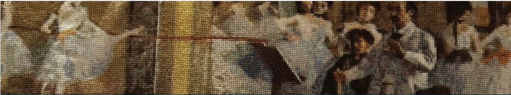

<br>  

**History & Technique page**. This page is split into three sections including a list of cross-stitching steps to follow and a video. 

- **The History section**. This part fo the page provides a brief history of the cross-stitch as a type of embroidery, its use for practical sewing skills in earlier times and how it developed into a hobby in the mid-20th century. 

  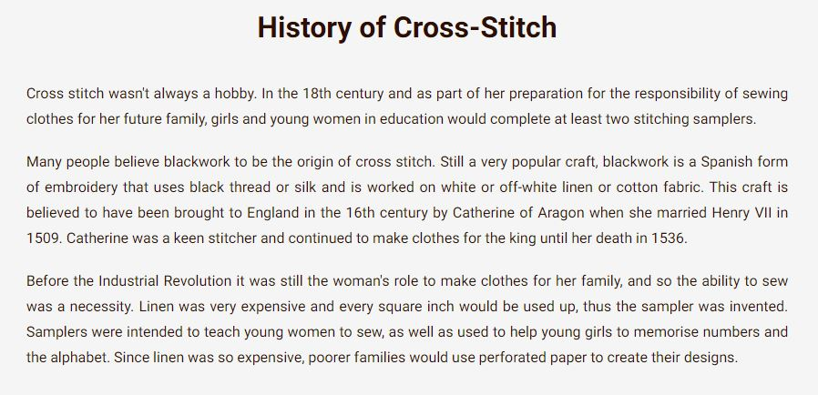

- **The Technique section**. Following the history section, this section gives a general overview of different aspects to consider when starting to cross-stitch. 

  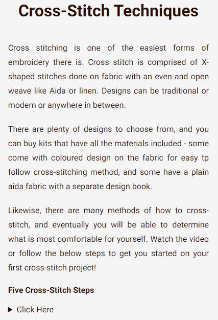

- **The five-step cross-stitch list**. This sub-section provides the user with a detailed break down of how to start cross-stitching and gives tips for best practices. The list is interactive and can be expanded and minimized by clicking on a "Click here" arrow which provides further engagement with the content. 

  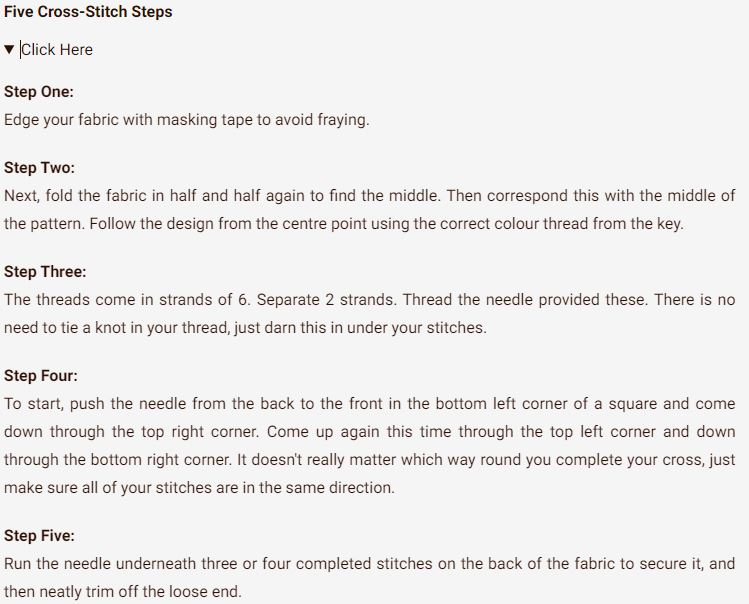

- **The video feature**  acts as a visual substitute to the five-step list allowing the user to interact with the content if they prefer video content as their learning material. 

  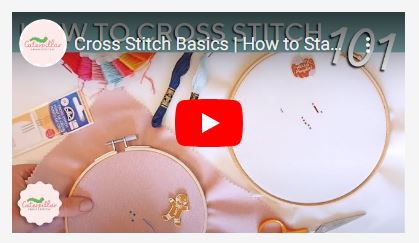

- On large screens, the five-step list is located directly below the technique section with the video on the side in one row. Upon clicking the arrow, the list expands below. On smaller screens, such as smartphones, the five-step list and the video feature are placed directly below the technique section. 


<br>

**Portfolio Gallery** page is divided into two sections that allow the user to easily identify the type of cross-stitch projects are currently underway and which are completed. 

- **Portfolio gallery** showcases all completed cross-stitch projects. The titles of each art work are written on a translucent background to give a better visual impact to the user. 

  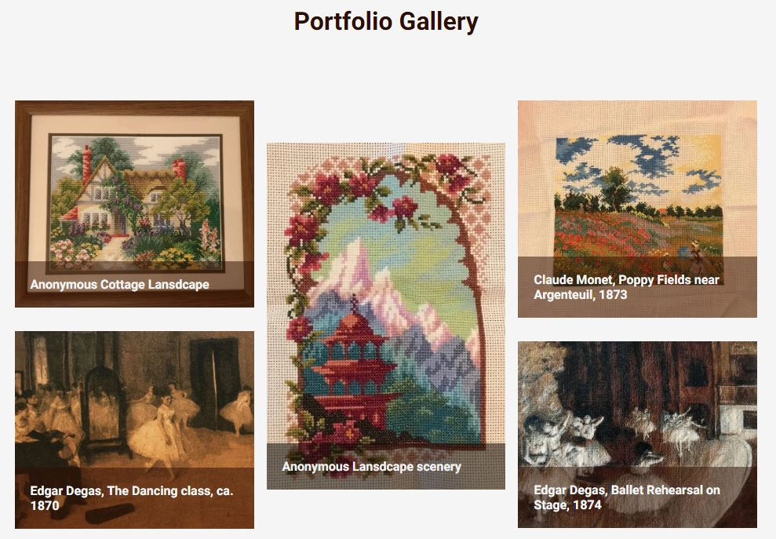 

- **Current projects** section shows cross-stitching work that is in progress and uses an original artwork's image until it is completed. 

  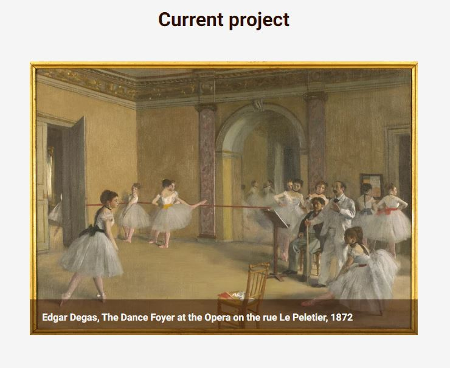

- On smaller screens both sections show one image per line allowing the user to easily scroll down and view them individually. On larger screens the portfolio gallery section is placed in three columns and two rows to accommodate all of the images together in a smaller space, creating an eye pleasing image gallery. 

<br>

**404 Error page** has been included in case there are any bugs that prevent websites or links from working properly. 
- The page has a stylised link that clearly indicates interactivity and takes the user back to the Home page of the website. 

  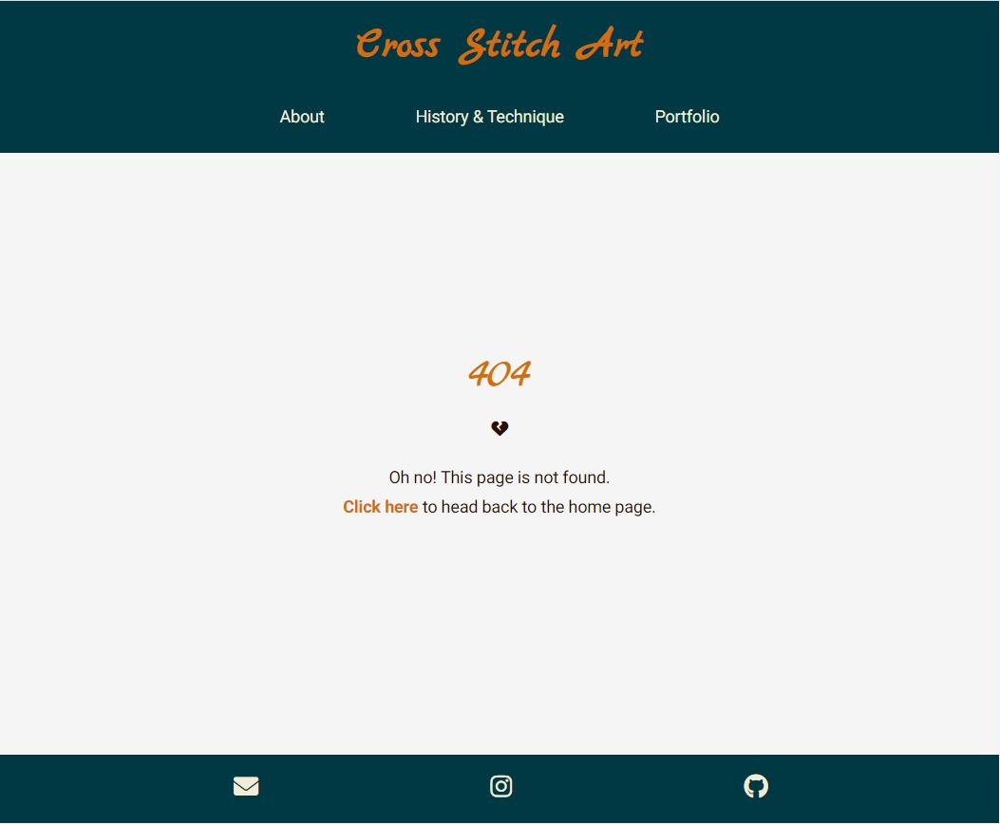

### Features Left to Implement

  - Use JavaScript to implement a brushstroke hover effect to the header menu.
  - Customise the five-step list in the Technique section with the crafter's own list of steps to follow.
  - Use JavaScript to implement image toggle/flip function upon click to reveal the original work of art on which the cross-stitch project is based on. This would be achieved by hover over effect revealing "click on" text. Upon the click the image would flip. 
	  - Alternatively, upon clicking the user would be taken to an external website (an art gallery or museum) that would show the original work of art and provide more information about the work.
	  - Another option would show the current text overlay rising from the bottom up, to show a "click to reveal the artwork" text, and would prompt the user to view the original work of art.
  - Continue updating the portfolio gallery with more projects as they progress.
  - Impletement a detailed image gallery for each completed project that shows screenshots of page-by-page progress of the project.
  - Include an Etsy link in the footer that would take the user to the crafter's Etsy page.

### Accessibility
  - I have followed good accessibility stardard practices by including the following:
	  - I used semantic HTML.
	  - I included descriptive atl attributes to used images. 
	  - I marked the current page with the "current" attribute to ensure that screen readers indicate it to the users.
	  - I provided descriptive information for the screen readers where icons were used.
	  - I ensured that sufficient color contrast is provided when choosing the color palette.    

 [Return to Table of Contents](#table-of-contents)

## Tools and Technologies
### Languages used

HTML and CSS languages were used for creating this website.
Markdown was used for creating the README file.

### Frameworks, Libraries and Programs used

The following resources were used to help implement the website:
- [Basamiq](https://balsamiq.com/) for creating wireframes
- [GitHub](https://github.com/) for creating and storing files and folders of the website
- Git was used for version control
- VScode editor for writing the code
- [Font Awesome](https://fontawesome.com/) for providing iconography for the website
- [Google Fonts](https://fonts.google.com/) for choosing appropriate fonts
- [Favicon](https://favicon.io/) for generating a favicon
- Google Chrome DevTools for testing, troubleshooting and brainstorming code solutions
- [Am I Responsive?](https://ui.dev/amiresponsive) website for showing the website's responsiveness on different devices
- [Pixelied](https://pixelied.com/), [ILoveIMG](https://www.iloveimg.com/), Gimp, [Tiny PNG](https://tinypng.com/) for resizing, compressing and editing images
- [Coolors](https://coolors.co/) for generating the color palette
- WCAG color contrast checker for website accessibilty

 [Return to Table of Contents](#table-of-contents)

## Deployment
This website was deployed using GitHub pages. The steps to deploy are as follows:

1. Login to GitHub and navigate to the repository page (Cross-Stitch-Art), click on the chosen repository.
2. Once inside the repository, click on the "Settings" tab above the repository title.
3. Select "Pages" tab on the left side navigation menu.
4. In the "Source" section (middle of the screen), select "main" or "master" branch, then "root" folder and click "save" button.
5. The GitHub page site will be deployed. 

It might take a few minutes to generate the "live" website link.

The live link to Cross Stitch Art can be found here: [Cross Stitch Art](https://laurakond.github.io/Cross-Stitch-Art/).

 [Return to Table of Contents](#table-of-contents)


## Testing 
The website has been tested on Mozilla Firefox desktop, Internet Explorer desktop, Safari mobile, Google Chrome desktop and mobile. 

###  W3C Validator Testing
All HTML pages and CSS file were tested against W3C Markup and CSS validation services.

**HTML**
- The first run of the History & Technique page through W3C validator returned an inline styling error for the iframe element. I subsequentially moved the inline styling to CSS stylesheet.
	- A semantic error within the nested list element in the History & Technique page was returned because I used a header and a paragraph elements within the nested list. 
	- I attemped multiple solutions but realised that none of the variations were semantically correct. This was resolved by applying a pseudo element "first-line" to the appropriate elements in the nested 'Five Steps' list. The solution was provided by the [Stack overflow](https://stackoverflow.com/questions/21793711/how-do-i-apply-a-bold-to-first-li-elements-in-nested-structure) website. Below is the code used:
```scss
.steps:first-line{
  font-weight: bold;
}
```    
- The final run of the History & Technique page through the W3C validator returned no errors  W3C validator. 
- Screenshots of all the test results can be seen below:
	- [index.html](documentation/testing/w3c/index-W3C-test.JPG) 
	- [history.html](documentation/testing/w3c/history-technique-W3C-test.JPG)
	- [portfolio.html](documentation/testing/w3c/portfolio-W3C-test.JPG)
	- [404.html](documentation/testing/w3c/404-W3C-test.JPG)

**CSS**

- No errors were found when passing through the official W3C CSS validator. Screenshot of the test result can be seen [here](documentation/testing/w3c/CSS-W3C-test.JPG). 

### Unfixed Bugs
- Embedded YouTube video has come with third party and reading cookies that are detected when using Chrome DevTools feature, this cannot be altered. This bug is also affecting the Lighthouse Performance score.

  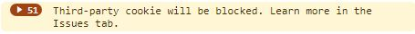
  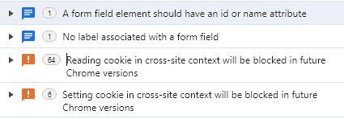

- "Page prevented back/forward cache restoration" error has been noted when running Lighthouse test for the History & Technique page. It is currently not possible to amend/fix the error due to pending browser support. 
- "Error with Permissions-Policy header: Origin trial controlled feature not enabled: 'interest-cohort'" message appears when running Lighthouse via Chrome DevTools. Upon further research into the matter it appears that it does not affect the usability of the site, however, it is caused due to Github blocking data being gathered for FLoC. 
  
### Lighthouse
Lighthouse scores vary depending on each page and whether it is a desktop or a mobile. I have listed the main denominators that are causing a drop in scores. Each of these is something to look into at the next development stage. 

#### The Home page
- Performance score is affected due to cache policy and render-blocking resources. The latter can be prevented by the use of JavaScript. 
	- **Desktop test score:**

  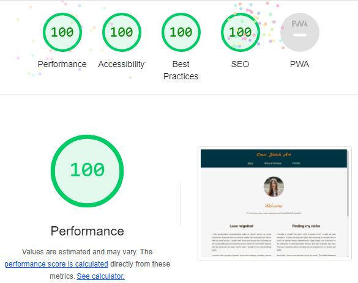
	- **Mobile test score:**
  
  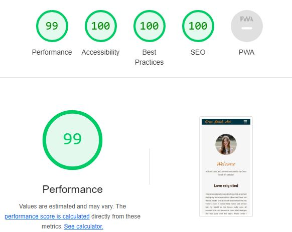

#### The History & Technique page
- Performance score is affected by"Page prevented back/forward cache restoration" error which is described in the [Unfixed Bugs](#unfixed-bugs) section.
- Accessibility score is affected due to "the heading elements not [being used] in a sequentially-descending order". The current order of elements (h3) was chosen to provide design continuity for text based sections. 
- Best Practice score is affected due to the mentioned third party and reading cookies in the [Unfixed Bugs](#unfixed-bugs) section that are caused by the video content.  
	- **Desktop test score:**
	
      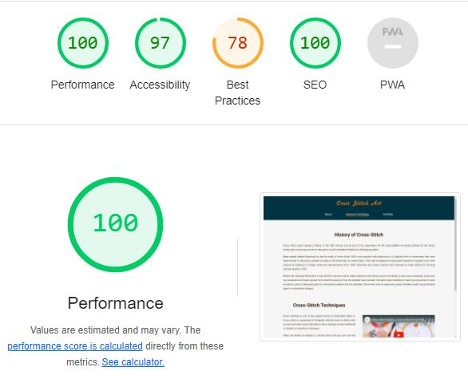
	- **Mobile test score:**

      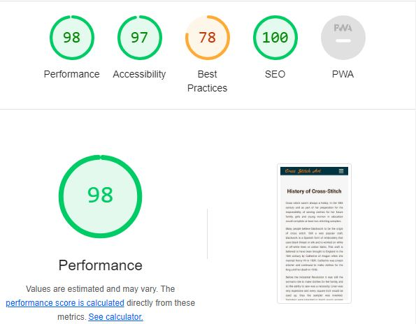

#### The Portfolio page
- Performance score is affected due to the use of high-quality image files that I supplied myself. The images have been compressed and reduced in size as much as possible, however, further reductions would cause poor image quality with visible pixelation on bigger screens. This is something to address in the next development stage.
- Accessibility score is affected due to "the heading elements not [being used] in a sequentially-descending order". The current order of elements (h3) was chosen to provide design continuity for text based sections, also mentioned in the History page. 
	- **Desktop test score:**

	    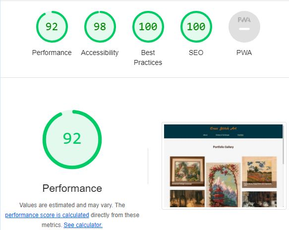
	- **Mobile test score:**

	    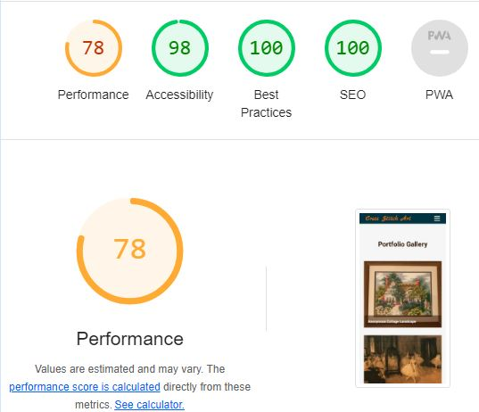

#### 404 page
- Accessibility score is affected due to the use of lighter colour font against the background colour.
- Performance score in mobile is affected due to static cache assets that could be resolved with JavaScript and better coding practices.
- SEO score is affected as the chosen "Click here" link name is not considered descriptive enough.
- **Desktop test score:**
      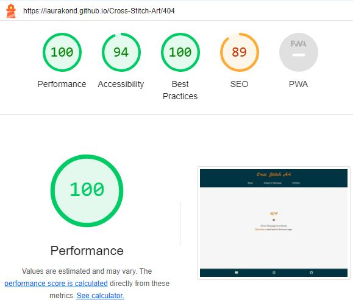

- **Mobile test score:**
      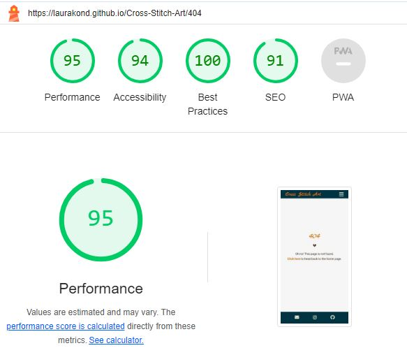

 [Return to Table of Contents](#table-of-contents)

## Credits

The following resources have been used in preparation to and while creating the Cross Stitch Art website:

### Content
The content for the home and portfolio pages was written by me. Due to time contraints the content for the History & Technique page was taken from the following sources and adapted to fit the purpose of the website:
- [Stitched Modern](https://stitchedmodern.com/blogs/news/a-beginners-guide-to-cross-stitch) content from "What is cross-stitch" section.
- [Catterpillar Cross-stitch](https://www.caterpillarcrossstitch.com/blogs/blog/the-history-of-cross-stitch) content from "The History of cross-stitch" section.
- [Catterpillar Cross-stitch](https://www.caterpillarcrossstitch.com/pages/info) "How to Cross-stitch" content was used to provide the five-step list. 

### Used code
- W3Schools for [centering text overlay](https://www.w3schools.com/howto/howto_css_image_text.asp), for [centering an image](https://www.w3schools.com/howto/howto_css_image_center.asp), and for [centering profile image](https://www.w3schools.com/howto/howto_css_image_avatar.asp).
- [An article on how to style a video iframe](https://yoast.com/how-to-make-youtube-videos-responsive/).
- Code Institute's Love Running project played a major part in allowing me to have a reference point for how to create the header & the footer and the overall web layout.

### Media
#### Images
All of the images apart from one were supplied by me. The following image has been taken from the Musee d'Orsay website:
- [The Dance class at the foyer of Rue Le Peletier Musee d'Orsay](https://www.musee-orsay.fr/en/artworks/le-foyer-de-la-danse-lopera-de-la-rue-le-peletier-1152).
 
#### Video
- The video content was taken from the Caterpillar Cross Stitch Youtube [channel](https://www.youtube.com/@CaterpillarCrossStitch).

#### General resources
The following resources were used to better familiarise myself with various concepts and coding practices, for example Media Queries functionality:
- [freeCodeCamp](https://www.freecodecamp.org/news/css-media-queries-breakpoints-media-types-standard-resolutions-and-more/)
- [Dani Krossing video on Youtube](https://www.youtube.com/watch?v=UUjNEMXZA-k)
- [WebDev Simplified channel](https://www.youtube.com/watch?v=yU7jJ3NbPdA)
- [CSS Tricks website](https://css-tricks.com/a-complete-guide-to-css-media-queries/)

Other websites used for general knowledge and minor troubleshooting during the website development stage:
- [Stack Overflow](https://stackoverflow.com/)
- [Browser Stack](https://www.browserstack.com/)
- [freeCodeCamp](https://www.freecodecamp.org/)
- [W3Schools](https://www.w3schools.com/)
- [SheCodes](https://www.shecodes.io/)


### Acknowledgments
My thanks goes to my mentor, [Martina Terlevic](https://github.com/SephTheOverwitch), for providing guidance, and support on all things code and project.

I also want to thank the Slack community students for further guidance, cheering on and keeping the morale up. 


### Code inspiration
Code Institute's Love Running project was used as an inspiration for the overall website layout and some concepts, including the code of the header and footer, the profile and the landscape detail image, and portfolio gallery image layout. 

 [Return to Table of Contents](#table-of-contents)